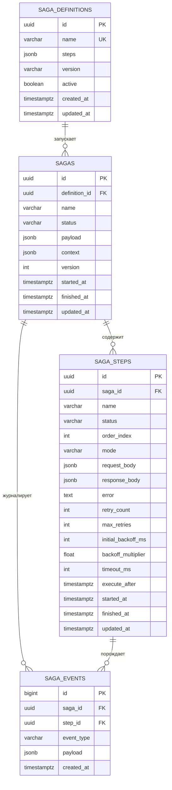

```mermaid
erDiagram
    SAGA_DEFINITIONS {
        uuid id PK
        varchar name UK
        jsonb steps
        varchar version
        boolean active
        timestamptz created_at
        timestamptz updated_at
    }

    SAGAS {
        uuid id PK
        uuid definition_id FK
        varchar name
        varchar status
        jsonb payload
        jsonb context
        int version
        timestamptz started_at
        timestamptz finished_at
        timestamptz updated_at
    }

    SAGA_STEPS {
        uuid id PK
        uuid saga_id FK
        varchar name
        varchar status
        int order_index
        varchar mode
        jsonb request_body
        jsonb response_body
        text error
        int retry_count
        int max_retries
        int initial_backoff_ms
        float backoff_multiplier
        int timeout_ms
        timestamptz execute_after
        timestamptz started_at
        timestamptz finished_at
        timestamptz updated_at
    }

    SAGA_EVENTS {
        bigint id PK
        uuid saga_id FK
        uuid step_id FK
        varchar event_type
        jsonb payload
        timestamptz created_at
    }

    SAGA_DEFINITIONS ||--o{ SAGAS : "запускает"
    SAGAS ||--o{ SAGA_STEPS : "содержит"
    SAGAS ||--o{ SAGA_EVENTS : "журналирует"
    SAGA_STEPS ||--o{ SAGA_EVENTS : "порождает"
```
