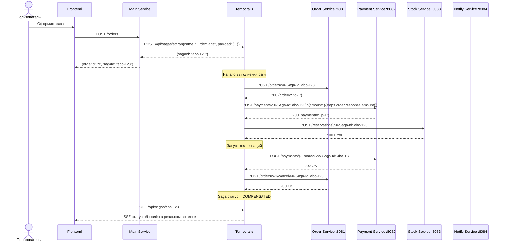

```mermaid
sequenceDiagram
    actor User as Пользователь
    participant FE as Frontend
    participant MS as Main Service
    participant TMP as Temporalis
    participant SVC1 as Order Service :8081
    participant SVC2 as Payment Service :8082
    participant SVC3 as Stock Service :8083
    participant SVC4 as Notify Service :8084

    User->>FE: Оформить заказ
    FE->>MS: POST /orders
    MS->>TMP: POST /api/sagas/start\n{name: "OrderSaga", payload: {...}}
    TMP-->>MS: {sagaId: "abc-123"}
    MS-->>FE: {orderId: "x", sagaId: "abc-123"}

    Note over TMP: Начало выполнения саги

    TMP->>SVC1: POST /orders\nX-Saga-Id: abc-123
    SVC1-->>TMP: 200 {orderId: "o-1"}

    TMP->>SVC2: POST /payments\nX-Saga-Id: abc-123\n{amount: {{steps.order.response.amount}}}
    SVC2-->>TMP: 200 {paymentId: "p-1"}

    TMP->>SVC3: POST /reservations\nX-Saga-Id: abc-123
    SVC3-->>TMP: 500 Error

    Note over TMP: Запуск компенсаций

    TMP->>SVC2: POST /payments/p-1/cancel\nX-Saga-Id: abc-123
    SVC2-->>TMP: 200 OK

    TMP->>SVC1: POST /orders/o-1/cancel\nX-Saga-Id: abc-123
    SVC1-->>TMP: 200 OK

    Note over TMP: Saga статус = COMPENSATED

    FE->>TMP: GET /api/sagas/abc-123
    TMP-->>FE: SSE статус обновлён в реальном времени
```
